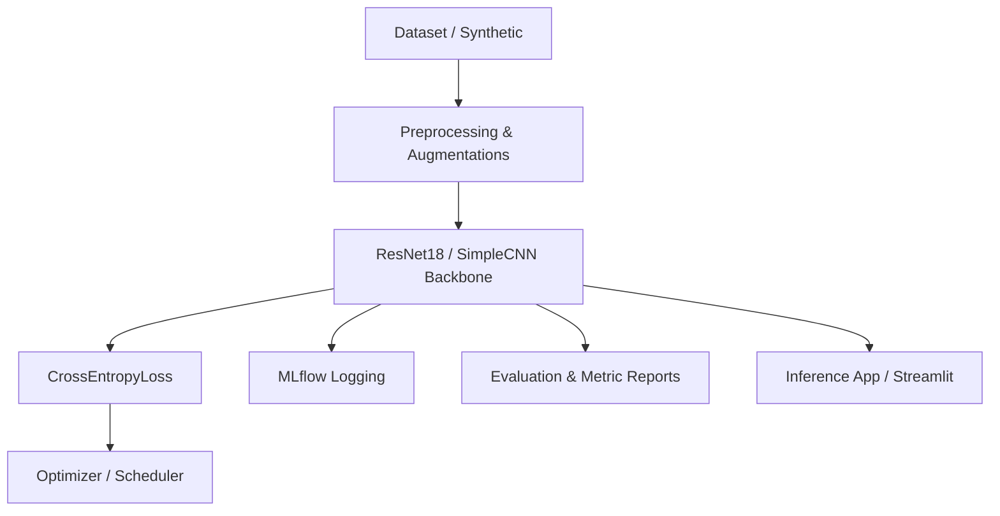

# System Architecture

This document describes the model architectures and software design of the Tankri OCR recognition pipeline.

## 1. Pipeline Overview

The system is structured as a modular handwritten character recognition pipeline containing:
* **Dataset Loader & Augmentations**: Custom data pipeline mapping character images to numeric indices with geometric, noise, and compression augmentations.
* **Model Backbone & Classifier Head**: Custom wrapper around standard ResNet18 model and SimpleCNN baseline, allowing layer freezing and custom classification/domain adaptation heads.
* **Training & Logging Engine**: Dynamic training loop tracking losses, accuracies, and logs parameters directly to MLflow.
* **Evaluation Suite**: Modules for generating validation metrics, classification reports, confusion matrices, and training curves.
* **Inference Engine**: Standard interface loading trained PyTorch checkpoints and performing OCR predictions.

---

## 2. Models

### ResNet18 wrapper (`src/models/resnet.py`)
A custom wrapper around `torchvision.models.resnet18` that:
1. Replaces the default classifier head (`fc` layer) with a single linear layer, or a custom Domain Adaptation MLP head when `ENABLE_DOMAIN_ADAPTATION` and `ADD_ADAPTATION_HEAD` are active.
2. Freezes specific layers dynamically (e.g., freezing early feature layers `conv1`, `bn1`, `layer1`, `layer2` and only fine-tuning late semantic layers `layer3`, `layer4`, or classifier).

### SimpleCNN (`src/models/simple_cnn.py`)
A lightweight baseline CNN containing:
* 3 Convolutional layers (32, 64, 128 channels) with ReLU activations.
* Max pooling layers.
* Flattening and fully connected layers.

---

## 3. Configuration & Single Source of Truth
All model hyperparameters and directory structures are configured in `src/configs/config.py`. No hardcoded configurations exist in training or evaluation scripts.
